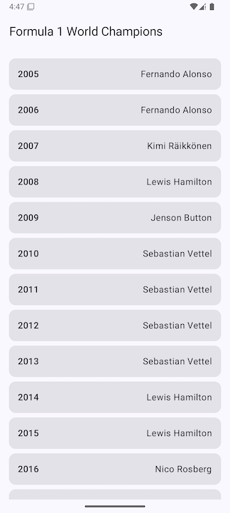
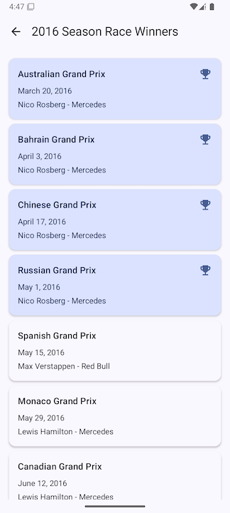

# F1 Champions Assessment

A Spring Boot application that fetches and displays F1 World Champions data using the Ergast API.

## Project Structure

```
f1-champions-assesment/
├── .github/                    # GitHub Actions workflows
│   └── workflows/
│       └── pr-validation.yml           # CI/CD pipeline PR validation
│       └── deploy.yml           # CI/CD pipeline deployment
├── backend/                    # Spring Boot application
│   ├── src/                   # Source code
│   ├── build.gradle.kts       # Gradle build configuration
│   ├── gradlew               # Gradle wrapper script (Unix)
│   ├── gradlew.bat           # Gradle wrapper script (Windows)
│   └── .editorconfig         # Code style configuration
├── frontend/                  # Android application
│   ├── app/                  # Main application module
│   ├── core/                 # Core utilities and common components
│   ├── data/                 # Data layer (repositories, API clients)
│   ├── domain/              # Domain layer (use cases, models)
│   ├── feature/             # Feature modules
│   │   └── seasonslist/     # Seasons list feature module
│   │   └── racewinners/     # Race winners feature module
│   ├── build.gradle.kts     # Root Gradle build configuration
│   ├── gradle/              # Gradle wrapper files
│   ├── gradlew             # Gradle wrapper script (Unix)
│   ├── gradlew.bat         # Gradle wrapper script (Windows)
│   └── settings.gradle.kts  # Gradle settings
├── infrastructure/           # Infrastructure and deployment
│   ├── Dockerfile           # Backend service Dockerfile
│   ├── docker-compose.yml   # Docker Compose configuration
│   ├── .dockerignore       # Docker ignore rules
│   ├── scripts/            # Utility scripts
│   │   └── setup-local-env.sh  # Local environment setup
│   └── secrets/            # Secrets directory (git-ignored)
├── .gitignore              # Git ignore rules
└── README.md              # This file
```

# F1 Champions

A mobile application that displays F1 champions and race winners, with a backend API serving the data.

## Architecture

### High-Level Overview
- **Frontend**: Android app (Kotlin)
  - Multi-module architecture (app, core, data, domain, feature)
  - Clean Architecture principles
  - MVVM pattern
  - Uses Jetpack Compose for UI

- **Backend**: Spring Boot API (Kotlin)
  - RESTful API design
  - Integrates with Ergast API for F1 data
  - PostgreSQL database for caching
  - Docker containerization

### Trade-offs
1. **Architecture Decisions**
   - Multi-module Android app
     - Pros: Better separation of concerns, reusable components, easier testing
     - Cons: Increased build time, more complex project structure
   
   - Clean Architecture
     - Pros: Maintainable, testable, independent of frameworks
     - Cons: More boilerplate code, steeper learning curve

2. **Data Management**
   - Direct Ergast API integration
     - Pros: Real-time data, no data maintenance
     - Cons: Dependent on external service, potential rate limits
   
   - Local caching with PostgreSQL
     - Pros: Faster response times, reduced API calls
     - Cons: Additional infrastructure, data synchronization

3. **Deployment Strategy**
   - GitHub Container Registry (GHCR)
     - Pros: Integrated with GitHub, easy versioning
     - Cons: Limited to GitHub ecosystem
   
   - GitHub Releases for APK
     - Pros: Simple distribution, version tracking
     - Cons: Manual installation required

## Local Development

### Prerequisites
- Docker and Docker Compose
- JDK 17
- Android Studio
- Gradle

### Running the Application

1. **Start the Backend**
   ```bash
   # Start the database and backend
   docker compose up -d
   
   # Check logs
   docker compose logs -f
   ```

2. **Run the Android App**
   - Open the project in Android Studio
   - Select the `app` module
   - Choose a device/emulator
   - Click Run

### Running Tests

1. **Backend Tests**
   ```bash
   # Run all backend tests
   cd backend
   ./gradlew test
   
   # Run with coverage
   ./gradlew jacocoTestReport
   ```

2. **Android Tests**
   ```bash
   # Run all Android tests
   cd frontend
   ./gradlew test
   
   # Run with coverage
   ./gradlew koverHtmlReport
   ```

### Triggering the Pipeline

1. **Feature Development**
   ```bash
   # Create a new feature branch
   git checkout -b feature/your-feature develop
   
   # Make changes and commit
   git add .
   git commit -m "Your commit message"
   
   # Push and create PR
   git push origin feature/your-feature
   ```
   Then create a PR to `develop` on GitHub

2. **Deployment**
   - Create a PR from `develop` to `main`
   - Merge to trigger deployment
   - Check GitHub Actions for progress
   - Verify release and Docker image

## API Contract

### Base URL  

https://api.jolpi.ca/ergast/f1  

### Endpoints

#### 1. Get Driver Standings  

GET /{year}/driverStandings/1.json  

Response:
```json
{
  "MRData": {
    "StandingsTable": {
      "season": "2023",
      "StandingsLists": [{
        "season": "2023",
        "round": "22",
        "DriverStandings": [{
          "position": "1",
          "points": "575",
          "wins": "19",
          "Driver": {
            "driverId": "max_verstappen",
            "permanentNumber": "1",
            "code": "VER",
            "url": "http://en.wikipedia.org/wiki/Max_Verstappen",
            "givenName": "Max",
            "familyName": "Verstappen",
            "dateOfBirth": "1997-09-30",
            "nationality": "Dutch"
          },
          "Constructors": [{
            "constructorId": "red_bull",
            "url": "http://en.wikipedia.org/wiki/Red_Bull_Racing",
            "name": "Red Bull",
            "nationality": "Austrian"
          }]
        }]
      }]
    }
  }
}
```

#### 2. Get Race Results  

GET /{year}/results/1.json  


Response:
```json
{
  "MRData": {
    "RaceTable": {
      "season": "2023",
      "Races": [{
        "season": "2023",
        "round": "1",
        "raceName": "Bahrain Grand Prix",
        "Results": [{
          "number": "1",
          "position": "1",
          "points": "25",
          "Driver": {
            "driverId": "max_verstappen",
            "permanentNumber": "1",
            "code": "VER",
            "url": "http://en.wikipedia.org/wiki/Max_Verstappen",
            "givenName": "Max",
            "familyName": "Verstappen",
            "dateOfBirth": "1997-09-30",
            "nationality": "Dutch"
          },
          "Constructor": {
            "constructorId": "red_bull",
            "url": "http://en.wikipedia.org/wiki/Red_Bull_Racing",
            "name": "Red Bull",
            "nationality": "Austrian"
          },
          "grid": "1",
          "laps": "57",
          "status": "Finished",
          "Time": {
            "millis": "5636736",
            "time": "1:33:56.736"
          },
          "FastestLap": {
            "rank": "2",
            "lap": "44",
            "Time": {
              "time": "1:35.762"
            },
            "AverageSpeed": {
              "units": "kph",
              "speed": "205.191"
            }
          }
        }]
      }]
    }
  }
}
```

## CI/CD Pipeline

The project uses GitHub Actions for continuous integration and deployment. The pipeline consists of two main workflows:

### 1. PR Validation (`pr-validation.yml`)

This workflow runs on pull requests to both `develop` and `main` branches.

#### Trigger Conditions
- When a PR is opened
- When new commits are pushed to the PR
- When a PR is reopened

#### Jobs
1. **Changes Detection**
   - Detects which parts of the codebase have changed
   - Monitors changes in:
     - Backend code (`backend/**`)
     - Frontend code (`frontend/**`)
     - Workflow files (`.github/workflows/**`)

2. **Backend Build and Test** (runs if backend or workflow files changed)
   - Sets up JDK 17
   - Runs Gradle build and tests
   - Uploads test results and coverage reports
   - Artifacts:
     - Test results: `backend-test-results`
     - Coverage report: `backend-coverage-report`

3. **Android Build and Test** (runs if frontend or workflow files changed)
   - Sets up JDK 17
   - Runs Android tests and generates coverage reports
   - Builds debug APK
   - Uploads build artifacts:
     - APK: `frontend/app/build/outputs/apk/dev/debug/*.apk`
     - AAR modules: `frontend/*/build/outputs/aar/*.aar`
     - Coverage reports: `android-coverage-reports`

### 2. Deployment (`deploy.yml`)

This workflow runs when a pull request to the `main` branch is merged.

#### Trigger Conditions
- When a PR to `main` is merged

#### Jobs
1. **Changes Detection**
   - Similar to PR validation
   - Only runs if the PR was actually merged

2. **Publish and Deploy**
   - Downloads artifacts from the successful PR validation run
   - Verifies and processes the Android APK
   - Creates a GitHub Release with:
     - The APK file
     - Release notes from the PR description
     - Version tag based on the commit SHA
   - Builds and pushes the backend Docker image to GitHub Container Registry (GHCR)
     - Tags: `latest` and commit SHA
     - Includes all necessary environment variables and configurations

### Deployment Flow

1. **Feature Branch → Develop**
   - Create a feature branch from `develop`
   - Make changes and create a PR to `develop`
   - PR validation workflow runs
   - After merge to `develop`, no workflows run

2. **Develop → Main**
   - Create a PR from `develop` to `main`
   - PR validation workflow runs
   - After merge to `main`:
     - Deploy workflow runs
     - Creates GitHub Release with APK
     - Deploys backend Docker image to GHCR

### Artifacts and Releases

- **Android APK**: Available in GitHub Releases
  - Each release is tagged with the commit SHA
  - Release notes include the PR description
  - APK is signed with debug key for development

- **Backend Docker Image**: Available in GHCR
  - Image: `ghcr.io/<repository>/<image-name>`
  - Tags: `latest` and commit SHA
  - Includes all necessary environment variables
  - Uses multi-stage build for optimization

### Security

- Database credentials are handled securely using GitHub Secrets
- Docker images are built with resource limits
- All sensitive files are cleaned up after use
- Workflow permissions are scoped to minimum required access

### Monitoring

- Test results and coverage reports are available in the Actions tab
- Release history is maintained in GitHub Releases
- Docker image versions are tracked in GHCR  


#### Screenshots

The application consists of two main screens:

1. **Seasons List Screen**  

   
   - Displays a list of F1 seasons
   - Shows the champion driver and constructor for each season
   - Allows navigation to race winners for a selected season

2. **Race Winners Screen**  

   
   - Shows all race winners for a selected season
   - Displays race name, date, and winner details
   - Highlights the winner if he's also the season's champion
   - Includes navigation back to seasons list  


#### Building and Testing

1. Navigate to the frontend directory:
   ```bash
   cd frontend
   ```

2. Build the project:
   ```bash
   ./gradlew build
   ```

3. Run tests:
   ```bash
   ./gradlew test
   ```

4. Generate coverage reports:
   ```bash
   ./gradlew koverHtmlReport
   ```

#### Development Guidelines

1. **Code Style**
   - Follow Kotlin style guide
   - Use ktlint for code formatting
   - Follow Material Design guidelines for UI

2. **Testing**
   - Write unit tests for all business logic
   - Use MockK for mocking
   - Maintain minimum 70% code coverage
   - Test both success and error cases

3. **Architecture**
   - Keep features modular and independent
   - Use dependency injection for better testability
   - Follow clean architecture principles
   - Keep UI and business logic separate

4. **UI/UX**
   - Use Jetpack Compose for all new UI
   - Follow Material Design 3 guidelines
   - Support dark/light themes
   - Handle configuration changes properly

## Contributing

1. Create a feature branch from `develop`
2. Make your changes
3. Submit a pull request

## License

This project is licensed under the MIT License - see the [LICENSE](LICENSE) file for details.